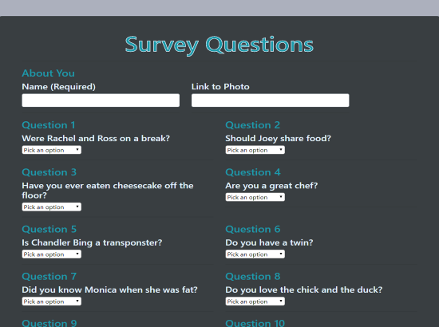

# **FriendFinder**
***
## Description  
This full-stack site will take in results from a survey, then compare their answers with those from other users. 
The app will then display the name and picture of the user with the best overall match.
Using Express to handle routing
***

***
## Libraries
   * [Express](https://www.npmjs.com/package/express)
   * [jQuery](https://jquery.com/)
   * [Boostrap](https://getbootstrap.com/)

***
## **Give it a try**
* ### [Try it here!](https://friend-finder-fevl.herokuapp.com/)
